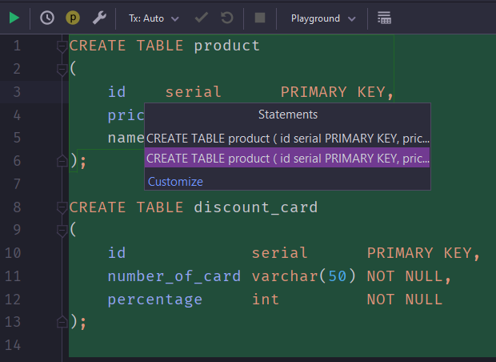

# Getting Started

At first, you need to clone this repo and open it in IDE.

```
git clone https://github.com/stasbadey/Clevertec_Task.git
```

### How to run application?

At first, you need to install PostgreSQL database. You can do it via Docker. Here is several commands:

``` 
docker pull postgres

docker run --name postgres -p 5432:5432 -e POSTGRES_USER=postgres -e POSTGRES_PASSWORD=postgres -e POSTGRES_DB=postgres -d postgres
```

You need to mention that if you change some properties like db or username, you need to change it also in `application.properties` file


The next step is to use DDL operations for creating tables. Run `ddl.sql` file.

Okay, let's start our application from CheckRunner class. As you can see I use Scanner for enter arguments. 
* You can enter some args like: `1-1 2-2 card-123`. Products are from 1 to 99 id. Cards are from 001 to 999 numbers.
* You can enter name of the text file that should to be in `resources` dir. In file `data.txt` you can use some data text file with working example data.

You can see the generated check in `output.txt` file.

Also you can see result from `http://localhost:8080/check?itemId=1&itemId=1` endpoint. Endpoint has only one parameter (List of integers).
You need to provide list of `itemIds` right here. Endpoint hasn't logic with discount card, so don't try to provide discount card in parameters. 

Stack, that I use in my application: 
1. postgresql - using for making database
2. spring - using for RESTFUL interface
